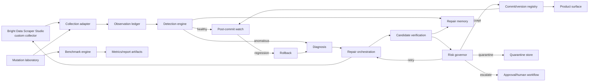

# 02 — Canonical Architecture

**Architecture status:** Strategy frozen; platform-specific seams remain open decisions.  
**Style:** Modular monolith with event/state-driven core.  
**Safety authority:** Deterministic verification and risk rules.

## Architecture principles

AEGIS is a closed control loop rather than a one-time repair pipeline. Collection is separated from trust evaluation. Proposal and evidence are separate concerns. Each lifecycle transition is auditable. The implementation should prefer one deployable unit with explicit modules and durable records over distributed services that add failure modes during the one-week sprint.

## System context



## Components and responsibilities

| Component | Responsibility | Must not do |
| --- | --- | --- |
| Collection | Invoke the custom collector through the Bright Data boundary and normalize collection metadata. | Decide that data is trustworthy. |
| Observation | Persist output, raw evidence, timestamps, fingerprints, and collector metadata. | Rewrite source output silently. |
| Detection | Evaluate contract, statistical, semantic, and response signals and emit DetectionEvents. | Commit a repair. |
| Diagnosis | Classify failure and produce a structured repair request using rules, memory, and optional LLM interpretation. | Treat an LLM opinion as deployment authority. |
| Repair orchestration | Call Bright Data healing, track attempts, polling, timeout, and candidates. | Mark a candidate verified merely because it returned data. |
| Verification | Evaluate candidates against deterministic evidence channels and optional semantic checks. | Mutate policy based on scraped text. |
| Risk governor | Choose accept, retry, quarantine, or escalate from verification evidence and policy. | Override safety invariants for convenience. |
| Quarantine | Prevent uncertain output from reaching downstream consumers and preserve evidence. | Drop evidence or silently retry forever. |
| Commit | Promote a verified candidate and record the known-good version. | Commit without the gate. |
| Post-commit watch | Run subsequent validation and detect regression. | Assume one successful run is permanent health. |
| Rollback | Restore the last known-good version and emit a RollbackEvent. | Delete the failed episode. |
| Memory | Store verified repair episodes and retrieve relevant prior evidence. | Become generic ungrounded RAG. |
| Mutation laboratory | Apply seeded controlled changes with expected outcomes. | Use unknown live-site outcomes as ground truth. |
| Benchmark engine | Run frozen baselines and AEGIS, calculate metrics, and export artifacts. | Change baseline configuration mid-run. |
| Product surface | Display trustworthy structured output and status. | Become a general analytics product. |

## Data flow

1. The Collection adapter requests a run from the Bright Data custom collector.
2. The Observation ledger stores the normalized output and evidence bundle as an immutable observation.
3. Detection evaluates the active ExtractionContract and emits either a healthy observation or an anomaly with channel-level findings.
4. Diagnosis creates a failure classification and repair request. A semantic model may assist, but the request is bounded by observed evidence.
5. Repair orchestration invokes the Bright Data healing boundary, polls under explicit timeout rules, and stores each returned candidate.
6. Verification creates one or more VerificationRuns. A commit candidate must have at least two independent deterministic channels passing; semantic opinion alone never suffices.
7. The Risk Governor emits a RiskDecision. Accepted candidates go to Commit; uncertain candidates go to Retry, Quarantine, or Escalation.
8. Commit records the new known-good version. Post-commit watch validates subsequent runs. Regression triggers Rollback and re-diagnosis.
9. Repair episodes, mutation metadata, and benchmark artifacts preserve the evidence trail.

## State machine

### States

| State | Definition | Entry evidence |
| --- | --- | --- |
| HEALTHY | Latest observation satisfies active contract and no anomaly is active. | Detection pass. |
| ANOMALOUS | Observation violates at least one detection rule or is flagged for investigation. | DetectionEvent. |
| DIAGNOSING | Failure type and repair request are being produced. | Anomaly accepted for diagnosis. |
| HEALING | Bright Data repair has been requested or is executing. | RepairAttempt started. |
| VERIFYING | One or more candidates are being evaluated. | Candidate recorded. |
| ACCEPTED | Candidate has passed verification and is eligible for commit. | Risk pre-decision pass. |
| REJECTED | Candidate failed verification. | Verification failure. |
| RETRYING | A bounded additional repair attempt is authorized. | Risk decision RETRY. |
| QUARANTINED | Output is withheld because evidence is insufficient or risk is high. | Risk decision QUARANTINE. |
| ESCALATED | Review is required through the available approval path. | Risk decision ESCALATE. |
| COMMITTED | Verified candidate promoted as active version. | Commit gate pass. |
| WATCHING | Committed version is under subsequent validation. | Commit complete. |
| REGRESSION | Watch detected deterioration after commit. | Watch anomaly. |
| ROLLING_BACK | Known-good version restoration is executing. | Rollback started. |

### Valid transitions

```text
HEALTHY → ANOMALOUS
HEALTHY → WATCHING
ANOMALOUS → DIAGNOSING
DIAGNOSING → HEALING
HEALING → VERIFYING
VERIFYING → ACCEPTED
VERIFYING → REJECTED
ACCEPTED → COMMITTED
REJECTED → RETRYING
REJECTED → QUARANTINED
REJECTED → ESCALATED
RETRYING → HEALING
COMMITTED → WATCHING
WATCHING → REGRESSION
REGRESSION → ROLLING_BACK
ROLLING_BACK → DIAGNOSING
WATCHING → HEALTHY
```

An implementation may model `HEALTHY` and `WATCHING` as separate pipeline and episode states, but the external terminology must remain consistent. Invalid transitions include any direct path from `HEALING` or `VERIFYING` to `COMMITTED`, any path from `REJECTED` to `COMMITTED`, and any path from `REGRESSION` to `HEALTHY` without rollback or an explicitly recorded safe revalidation.

## Reliability invariants

The commit gate requires a candidate reference, a completed verification run, at least two deterministic passing channels, no unresolved high-risk finding, and a recorded RiskDecision. The system must fail closed if verification is unavailable, evidence is malformed, authorization is missing, or the known-good version cannot be identified. Blind Commit Rate is defined as commits without the required deterministic evidence and must be zero.

## Failure handling, async behavior, and retries

External calls are asynchronous from the controller’s perspective. Each attempt needs a correlation ID, start time, deadline, terminal status, and raw provider response or error classification. Retries are bounded per episode and must not duplicate a commit. The retry budget, polling interval, and timeout are open decisions until Day-1 platform spikes establish safe values. On exhaustion, AEGIS quarantines or escalates rather than looping indefinitely.

## Rollback behavior

A commit must register a known-good version before it becomes active. A watch regression creates a RollbackEvent containing the triggering evidence, prior version, target version, and outcome. Rollback is itself verified: the restored version must pass the active contract and safety checks before the pipeline is marked healthy. If rollback fails, the pipeline remains quarantined or escalated.

## Memory and mutation-lab relationship

A RepairEpisode links failure evidence, diagnosis, repair requests, candidate outcomes, verification evidence, risk decision, latency, cost, and mutation class when known. The Mutation Laboratory creates the controlled episodes used to validate memory and benchmark behavior, but memory retrieval cannot override current evidence or policy.

## Architecture decisions

The modular monolith is selected because the project needs fast iteration, deterministic local tests, a single audit trail, and minimal operational overhead. Module boundaries must be explicit so that later extraction is possible, but distributed deployment is not a goal. Bright Data remains the actual scraper execution/healing layer. The LLM is a bounded proposal/interpretation component. Verification-before-commit, quarantine, rollback, frozen baselines, and controlled ground truth are architectural commitments.

## Open decisions

Bright Data execution and healing API shape, authentication, approval mechanism, version/rollback semantics, raw response/WARC availability, staging environment, queue mechanism, persistence technology, and exact LLM configuration are **OPEN DECISIONS**. Each is recorded in `18_BRIGHT_DATA_INTEGRATION.md` and must be resolved by an experiment or explicitly bounded fallback before implementation claims are made.
