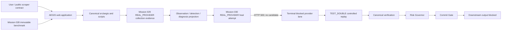

# AEGIS Final Demo Architecture

| Boundary | Authority | Demonstration status |
| --- | --- | --- |
| Bright Data collection | Provider execution substrate | `REAL_PROVIDER`: Mission 029 collector and 150-row public collection. |
| Bright Data healing | Provider repair proposal substrate | `REAL_PROVIDER`: Mission 030 compact heal ended HTTP 500 before candidate creation. |
| AEGIS detection and diagnosis | Canonical AEGIS projection | Historical Mission 029 evidence plus controlled demonstrator context. |
| Candidate, verification, risk, commit | Canonical deterministic AEGIS modules | `TEST_DOUBLE` controlled replay only; never a Bright Data candidate claim. |
| Downstream output | Output eligibility boundary | `BLOCKED` when verification fails and Commit Gate is ineligible. |
| Benchmark | Frozen, read-only artifact | Mission 028 controlled harness; never started from the frontend. |

The Node webapp is a presentation and transport boundary. It calls the repository-root Python projection with bounded execution and returns normalized evidence; it does not contain independent detection, verification, risk, or commit logic.
