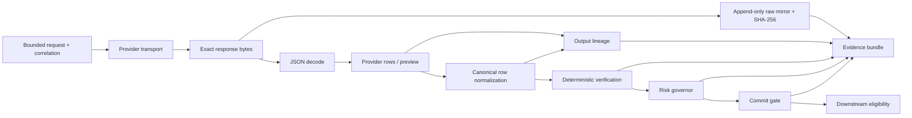

# Mission 056 Dependency and Evidence Map

**Status:** Static, provider-free analysis.
**Scope:** The current Bright Data collection, heal, approval, and synchronous rerun paths, plus the AEGIS evidence gates that consume their output.
**Provider operations performed for this map:** `0`.

> **Design invariant:** provider data is untrusted input. A real provider success does not authorize verification, risk acceptance, commit, or downstream delivery.

## Canonical control flow

The canonical architecture requires collection to remain separate from trust evaluation and requires raw evidence, timestamps, fingerprints, collector metadata, a correlation identifier, a deadline, a terminal status, and an error classification for every external attempt. It also forbids a direct route from healing or verification to production commit.[`docs/02_ARCHITECTURE.md`](../../docs/02_ARCHITECTURE.md)

## Current executable paths

| Lifecycle step | Current entry point | First persisted provider boundary | AEGIS transformation | Current deterministic gate | Gap requiring Mission 056 work |
| --- | --- | --- | --- | --- | --- |
| CLI collector run | `BrightDataCliAdapter.run_collector()` | CLI stdout is parsed by `_last_array()` only after the subprocess returns | `CollectionResult.output` records rows and field names | Collection does not make a trust decision | The command does not accept or record an explicit template version, and raw stdout bytes are not preserved before parsing. |
| CLI heal | `BrightDataCliAdapter.request_healing()` → `poll_healing()` | CLI stdout is parsed by `_last_object()` after the subprocess returns | `HealProviderEnvelope` and unverified `RepairCandidate` retain preview, status, operation ID, diff, and provider approval command as data | Candidate remains unverified and no approval is called | Raw stdout is not mirrored; no selected version/revision is requested or persisted; preview parsing is coupled to lifecycle handling. |
| One-shot candidate-only heal | `scripts/mission053_candidate_only_heal.py` | `stdout` is written once to `raw_provider_response.bin` when it is nonempty and not secret-like | JSON parsing extracts status, candidate preview, field presence, and safe summary | Stops before approval and rerun | It is mission-specific, has no common operation correlation record, and cannot establish a post-heal runtime result. |
| Approval | `approve_pending_self_healing_once()` | HTTP body is intentionally discarded after safe status/content-type metadata | `OneShotApprovalResult` retains only coarse metadata | Must remain separately authorized; does not commit | It requires a Mission 040-only correlation prefix, cannot retain safe raw/provider operation metadata, and does not record version/revision. |
| Synchronous rerun | `rerun_collector_once()` | `response.read()` occurs before JSON decoding; exact bytes and SHA-256 are kept in memory | A JSON array becomes a tuple of top-level row dictionaries and a schema summary | The transport itself makes no trust decision | Its `/dca/crawl` request has no version parameter; correlation prefixes exclude Mission 056; result metadata has no requested/selected version or revision. |
| Output lineage | `analyze_output_lineage()` | Consumes decoded provider rows and normalized AEGIS rows, never values beyond supplied rows | Reports missing, null, empty, partial, and normalization-loss states | Identifies `PROVIDER_RESPONSE` versus `AEGIS_NORMALIZATION` first-loss boundaries | Requires every future real rerun to feed it both decoded and normalized rows. |
| Verification | `verify_candidate()` | Consumes the normalized candidate output and deterministic evidence references | Runs contract, history, semantic, and independent-evidence channels | Requires contract, semantics, and independent evidence to pass; history may be unavailable | A credible clean target needs a maintained independent evidence path that is not double-counted with collection history. |
| Risk | `RiskGovernor.decide()` | Consumes a completed verification result and unverified candidate | Emits `ACCEPT`, `REJECT`, or `QUARANTINE` | Cannot accept without all required deterministic channels | `ACCEPT` only means future-commit eligible; it is not provider activation. |
| Commit/downstream | `CommitGate.evaluate()` → `OutputEligibilityBoundary.evaluate()` | Consumes candidate, verification, risk, known-good version, and authorization | Produces explicit eligible/blocked and downstream-eligible/blocked records | Must fail closed if authorization, evidence, version, or correlation is incomplete | Owner policy currently keeps real commit and delivery blocked even if the earlier gates pass. |

## Required-field transformation trace

The verified Mission 048C pattern is the canonical future rerun seam. The transport reads the response bytes before `json.loads()`. The caller persists those bytes once to a predeclared controlled path, writes their hash and size, appends a correlation record, and only then passes decoded rows through canonical normalization. The field lineage check compares decoded and normalized top-level fields before verification evaluates the normalized rows. This is how the system distinguishes an incomplete provider response from an AEGIS transformation loss.

| Stage | Required field representation | What may change | What must never happen |
| --- | --- | --- | --- |
| Raw provider bytes | Opaque bytes | Nothing; a hash is calculated | Decoding, normalization, or overwriting before raw-mirror preservation. |
| Decoded provider rows | Untrusted top-level row mappings | JSON decoding only | Silent field insertion, deletion, or value substitution. |
| Normalized AEGIS rows | Canonical `title`, `price`, and `availability` representation | Explicit, tested canonical row normalization | Unreported required-field loss. |
| Verification context | Canonical row sequence plus independent evidence | Deterministic contract and semantic checks | Treating history and correlated evidence as independent. |
| Risk/commit/downstream | Immutable decision records | Fail-closed policy evaluation | Converting `ACCEPT` into a production action without owner authorization. |

## Version and correlation findings

The CLI adapter's collector run command and the synchronous `POST /dca/crawl` rerun transport both select the provider default implicitly. Neither currently carries a requested version, records a selected version, nor records a template revision. This is a direct explanation for why Mission 041B could not be bound to a parser identity; it is **not** evidence that a development-production mismatch occurred.

`OperationCorrelationRecord` already retains an AEGIS operation ID, collector ID, target URL hash, UTC start, provider run ID, template version, operation type, and correlation ID. It needs an additive schema extension for the requested version, provider-selected version, revision, source of each value, and raw response digest. The extension must remain append-only and must preserve the existing version-one record schema for historical artifacts.

## Non-negotiable recovery constraints

The Bright Data integration contract classifies provider version/revision identity, activation semantics, raw response availability, and WARC as open decisions unless a controlled experiment establishes them. The contract requires a specific collector reference, request, input, provider output, schema, timestamps, provider operation ID, retry/poll behavior, revision/version evidence, and redacted payloads before a capability can be called verified.[`docs/18_BRIGHT_DATA_INTEGRATION.md`](../../docs/18_BRIGHT_DATA_INTEGRATION.md)

Mission 056 must therefore implement the missing local evidence mechanisms before any fresh provider experiment. A later candidate-only heal may be bounded only after an immutable experiment record specifies the collector, target, explicit version behavior, prompt hash, timeout, one-operation budget, no-retry rule, correlation IDs, raw response path, and terminal stop conditions. Approval and post-heal rerun remain separately gated.

The frozen Mission 034 approval amendment is fixture-only, while a later distinct Mission 040 artifact records a one-shot real approval. This is a scope conflict rather than a license to broaden either record. The reconciliation and Mission 056 restriction are preserved in [`approval_contract_conflict.md`](approval_contract_conflict.md); no frozen document or historical evidence has been modified.

## Phase 3 implementation targets

1. Add an explicit optional version selector to the CLI collector-run and synchronous rerun transport boundaries, with no implicit fallback hidden from evidence.
2. Preserve transport bytes before parsing for every new real path, using a caller-selected append-only controlled evidence path and a redaction-safe metadata manifest.
3. Extend operation correlation additively with requested version, selected version, revision, version-evidence source, raw digest, and provider operation identifiers.
4. Generalize the approval boundary's correlation prefix and add safe response metadata support without creating a provider mutation path outside separate owner authorization.
5. Add provider-free contract tests for command formation, version validation, raw-first persistence, correlation immutability, parsing failures, and fail-closed authorization boundaries.

## Source record

| Source | Used for |
| --- | --- |
| `src/aegis/adapter.py` | CLI run/heal commands, async state machines, payload parsing, candidate materialization. |
| `src/aegis/one_shot_rerun.py` | HTTP rerun bytes, parsing, safe metadata, and current version gap. |
| `src/aegis/one_shot_approval.py` | Documented approval POST and safe result boundary. |
| `src/aegis/operation_correlation.py` | Append-only correlation record schema and path behavior. |
| `src/aegis/output_lineage.py` | First field-loss classification. |
| `src/aegis/verification.py` | Deterministic multi-channel verification requirements. |
| `src/aegis/risk.py` | Risk decisions and future-commit-only meaning of acceptance. |
| `scripts/mission048c_evidence_preserving_rerun.py` | Proven provider-to-evidence orchestration pattern. |
