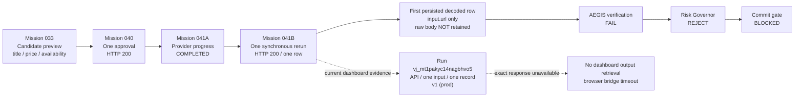

# Mission 041B Forensic Timeline

| Sequence | Evidence-supported event | Outcome |
|---|---|---|
| 1 | Mission 033 candidate preview | `title`, `price`, and `availability` were present. |
| 2 | Mission 040 approval | One approved operation returned HTTP 200. |
| 3 | Mission 041A progress | Provider reported `COMPLETED`. |
| 4 | Mission 041B rerun | One synchronous HTTP 200 rerun completed with one decoded row. |
| 5 | First persisted decoded row | Only `input.url` was retained; original provider response bytes were explicitly not retained. |
| 6 | Deterministic controls | Verification failed, risk rejected, commit remained blocked, and data was not shipped. |
| 7 | Mission 046 dashboard correlation | Run `vj_mt1pakyc14nagbhvo5` is uniquely bound by collector, request timestamp/local-time offset, API trigger, one input, one record, and `v1 (prod)`. |

The current active dashboard parser, output schema, target route, and production version all preserve the three required fields. The timeline therefore does **not** support a missing-schema or absent-parser explanation. It also does not prove that the provider itself returned only `input.url`, because the original Mission 041B response body was not retained and the correlated real-time output could not be opened through the browser bridge.

The Bright Data documentation says that real-time job outputs are stored provider-side but cannot be downloaded from the dashboard; structured output retrieval requires the relevant API/delivery path and identifier.[1] The same documentation describes a dashboard Quick View for collection records, but the authenticated browser bridge timed out before that view could be opened.[2]

## References

[1]: https://docs.brightdata.com/datasets/scraper-studio/features "Bright Data Scraper Studio dashboard features"
[2]: https://docs.brightdata.com/datasets/scraper-studio/features "Bright Data Scraper Studio dashboard features"
